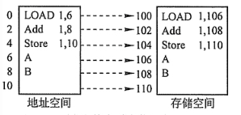
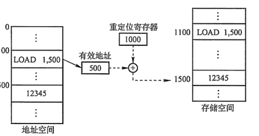
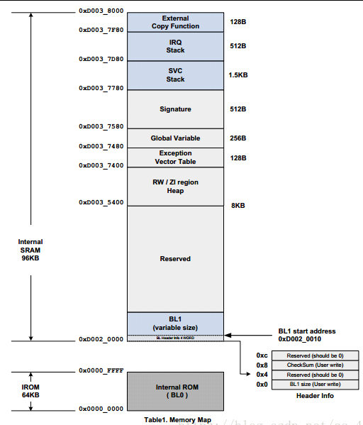

# 5 代码重定位

## 重定位

### 1 静态重定位

静态重定位是在程序执行之前进行重定位，它根据装配模块将要装入的内存起始

​        位置，直接修改装配模块的有关使用地址的指令。



### 2 动态重定位

动态重定位是指，不是在程序执行之前而是在程序执行过程中进行地址重定位。更确切地说，是在每次访问内存单元前才进行地址变换。动态重定位可是装配模块不加任何修改而装入内存，但是它需要硬件-定位寄存器的指出。



### 3 为什么需要重定位？

        我们知道代码分为:位置无关码和位置有关码。位置无关码在哪个地址上面运行效果都一样的，但是位置有关码就必须在规定的地址处运行才可以。这个规定的地址就是链接地址，而我们代码执行时候的地址是运行地址，位置有关代码要求链接地址和运行地址必须一致。但由于某些原因（例如：我们在用裸机时，我的DRAM还未进行初始化，而我们的代码又必须在DRAM上运行），我们不能把程序直接下载到相应的地址进行运行，所以就用到了重定位。

  ### 4 程序段

程序中的bss段，data段，代码段（.text），堆（heap），栈（stack）

        .bss段：程序中未初始化的和已经初始化为0的全局变量和已经初始化为0的静态局部变量（static）

        .data段：程序中已经初始化非零的全局变量和已经初始化的非零的静态局部变量（static）

        代码段：用来存放代码的地方（.text段），不可修改，存放在只读区域内

        堆：程序员自己申请的内存区域，也就是malloc（）函数申请的内存区域，用free（）函数来释放的区域

        栈：存放局部变量的区域，函数中的局部变量都是存放栈中



### 5 链接脚本

link.lds为链接脚本的名字

```
SECTIONS
{
    . = 0x20000000;　　　　　　//指定链接地址为0x20000000
    
    .text : {　　　　　　　　　//代码段
        start.o　　　　　　　　//指定链接的顺序为：start.o->sdram_init.o->其他的一些文件
        sdram_init.o
        * (.text)　　　　　　　//这里表示其他的一些.o文件
    }
            
    .data : {　　　　　　　　　　//数据段
        * (.data)　　　　　　　　//这里表示所有的数据段的文件
    }
    
    bss_start = .; 　　　　　　//把当前的地址赋值给bss_start
    .bss : {　　　　　　　　　　//bss段
        * (.bss)　　　　　　　　//所有bss段的文件
    }
    
    bss_end  = .;    　　　　　　//把当前的地址赋值给bss_end
}
```

### 6 重定位的具体实现 

```
// adr指令用于加载_start当前运行地址
    adr r0, _start          // adr加载时就叫短加载        
    　　　　　　　　　　　　　　// ldr指令用于加载_start的链接地址:0x20000000
    ldr r1, =_start 　　　　// ldr加载时如果目标寄存器是pc就叫长跳转，如果目标寄存器是r1等就叫长加载    
    // bss段的起始地址
    ldr r2, =bss_start    // 就是我们重定位代码的结束地址，重定位只需重定位代码段和数据段即可
    cmp r0, r1            // 比较_start的运行时地址和链接地址是否相等
    beq clean_bss        // 如果相等说明不需要重定位，所以跳过copy_loop，直接到clean_bss
                        // 如果不相等说明需要重定位，那么直接执行下面的copy_loop进行重定位
                        // 重定位完成后继续执行clean_bss。
 
// 用汇编来实现的一个while循环
copy_loop:
    ldr r3, [r0], #4    // 源，后面的#4就是：地址在不断的加4
    str r3, [r1], #4    // 目的   这两句代码就完成了4个字节内容的拷贝
    cmp r1, r2            // r1和r2都是用ldr加载的，都是链接地址，所以r1不断+4总能等于r2
    bne copy_loop
 
    // 清bss段，其实就是在链接地址处把bss段全部清零
clean_bss:
    ldr r0, =bss_start                    
    ldr r1, =bss_end
    cmp r0, r1                // 如果r0等于r1，说明bss段为空，直接下去
    beq run_on_dram            // 清除bss完之后的地址
    mov r2, #0
clear_loop:
    str r2, [r0], #4        // 先将r2中的值放入r0所指向的内存地址（r0中的值作为内存地址），
    cmp r0, r1                // 然后r0 = r0 + 4
    bne clear_loop
 
run_on_dram:    
    // 长跳转到led_blink开始第二阶段
    ldr pc, =led_blink                // ldr指令实现长跳转和bl是短加载
    //最后这里跳转，是跳转到重定位的代码所对应的led_blink这个函数那里去执行的
    
// 汇编最后的这个死循环不能丢
    b .
```

总结：由上面我们可以看到：重定位的时候，先使用一段位置无关码来对重定位的地址那里的内存进行一些操作。

            （1）、把整段代码搬用过重定位的内存哪里（用copy_loop来实现）

            （2）、清bss段（clean_bss）来实现

            （3）、跳转到重定位的那段内存去执行（run_on_dram来实现）


转发：[ARM之重定位和链接脚本](https://blog.csdn.net/qq_41003024/article/details/80308464)

