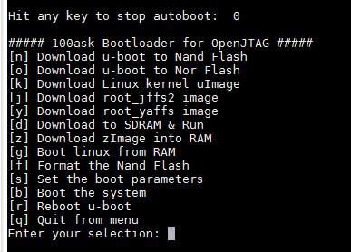

# U-boot分析与使用

BootLoader有很多种，u-boot是BootLoader中的其中一种，在嵌入式Linux中我们使用u-boot。最终的目的是启动内核。

## 1 启动过程

|           PC           |     嵌入式     |
| :--------------------: | :------------: |
|          BIOS          |   BootLoader   |
|  引导操作系统Windows   |   Linux内核    |
|       识别C,D盘        | 挂载根文件系统 |
| 运行应用程序QQ，微信等 |    应用程序    |

表中的作用是一一对应的。BootLoader的最终目的是启动内核。

- BIOS启动内核的过程：从硬盘上加载内核
- uboot启动过程：从flash上读出内核，读出来后放到sdram中，然后启动内核。

> uboot要实现的功能：
>
> - 硬件相关初始化（初始化时钟、关看门狗）
>
> - 从flash中读出内核
> - 能够初始化sdram
> - 启动内核
> - 其他（开发功能）：烧写flash、网卡、USB、串口

可以理解uboot为一个单片机程序。


## 2 u-boot使用

首先把uboot下载到nor flash，启动程序。

启动之后再倒数计时的时候，按空格键，进入uboot，不然会直接启动Linux系统。进入uboot的命令行，如图所示：



## 3 通过Makefile分析u-boot源码结构

### 3.1 分析配置过程

当使用命令make 100ask24x0_config进行配置的时候，就相当于执行如下命令：


对于MKCONFIG：

```
MKCONFIG	:= $(SRCTREE)/mkconfig
```

表示在SRCTREE目录下mkconfig文件。

对于$()表示目标:则他们可替换为


所以在这行make 100ask24x0_config命令的时候，就相当于执行上面蓝色部分的那句命令。

- 对mkconfig文件进行分析

```

# 传入：
# mkconfig 100ask24x0 arm arm920t 100ask240 NULL s3c24x0
#  $0       $1         $2   $3       $4       $5    $6

APPEND=no	# Default: Create new config file
BOARD_NAME=""	# Name to print in make output

# 个部分是判断传入的文件有灭有--、-a等等分析
while [ $# -gt 0 ] ; do
	case "$1" in
	--) shift ; break ;;
	-a) shift ; APPEND=yes ;;
	-n) shift ; BOARD_NAME="${1%%_config}" ; shift ;;
	*)  break ;;
	esac
done

# 判断BOARD_NAME是否已经定义，最开始BOARD_NAME=""，所以执行BOARD_NAME="$1"，BOARD_NAME = 100ask24x0
[ "${BOARD_NAME}" ] || BOARD_NAME="$1"


# $#表示出入参数的个数，当传入小于4个或者大于6个也会退出
[ $# -lt 4 ] && exit 1
[ $# -gt 6 ] && exit 1

# 打印
echo "Configuring for ${BOARD_NAME} board..."

#
# Create link to architecture specific headers
#
# 判断"$SRCTREE" != "$OBJTREE" 是否相等，在Makefile中有这个参数，但没有人去定义，所以这个部分不成立，会执行else部分
if [ "$SRCTREE" != "$OBJTREE" ] ; then
	mkdir -p ${OBJTREE}/include
	mkdir -p ${OBJTREE}/include2
	cd ${OBJTREE}/include2
	rm -f asm
	ln -s ${SRCTREE}/include/asm-$2 asm
	LNPREFIX="../../include2/asm/"
	cd ../include
	rm -rf asm-$2
	rm -f asm
	mkdir asm-$2
	ln -s asm-$2 asm
else
	cd ./include
	rm -f asm
	ln -s asm-$2 asm   # 建立一个连接文件：ln -s asm-arm asm ,asm指向asm-arm
	# 例如在源码的时候，我们使用#include <asm/type.h>就相当于#include <asm-arm/type.h>
fi

rm -f asm-$2/arch
## -z 在if里的意思是空，这里是表示第六个参数为空或者为NULL的话，就会执行，这里不成立，会执行else分支
if [ -z "$6" -o "$6" = "NULL" ] ; then
	ln -s ${LNPREFIX}arch-$3 asm-$2/arch
else
	ln -s ${LNPREFIX}arch-$6 asm-$2/arch # LNPREFIX没有定义，为空，所以：ln -s arch-s3c24x0 asm-arm/arch
										 # 在asm-arm/arch中建立指向 arch-s3c24x0
fi

if [ "$2" = "arm" ] ; then
	rm -f asm-$2/proc
	ln -s ${LNPREFIX}proc-armv asm-$2/proc # 建立连接文件：ln -s proc-armv asm-arm/proc
fi

#
# Create include file for Make
#
# 创建一个新的配置文件，> 表示建立，>>表示追加内容
echo "ARCH   = $2" >  config.mk
echo "CPU    = $3" >> config.mk
echo "BOARD  = $4" >> config.mk
# 内容：
# ARCH   = arm
# CPU    = arm920t
# BOARD  = 100ask240


# 如果第五个参数存在，并且第五个参数不等于NULL的话
# 再往config.mk中增加一项内容，但是这里的$5为NULL.
[ "$5" ] && [ "$5" != "NULL" ] && echo "VENDOR = $5" >> config.mk
# 
[ "$6" ] && [ "$6" != "NULL" ] && echo "SOC    = $6" >> config.mk

# 再往config.mk中加入：SOC    = s3c24x0


# Create board specific header file
# 创建一个单板相关的头文件
# 这里是不等于yes的所以，这些else分支，创建一个config.h文件
if [ "$APPEND" = "yes" ]	# Append to existing config file
then
	echo >> config.h
else
	> config.h		# Create new config file
fi
# 把信息追加到config.h文件中
echo "/* Automatically generated - do not edit */" >>config.h
echo "#include <configs/$1.h>" >>config.h   # #include<configs/100ask24x0.h>

exit 0
```

### 3.2 分析编译过程

当我们编译的时候，执行执行make命令，所以还是要对Makefile进行分析。

```
# 包含了以上生成的文件
include $(OBJTREE)/include/config.mk
# config.mk
# ARCH   = arm
# CPU    = arm920t
# BOARD  = 100ask240
# SOC    = s3c24x0
```

```
OBJS  = cpu/$(CPU)/start.o
# OBJS  = cpu/arm920t/start.o
```

```
LIBS  = lib_generic/libgeneric.a
LIBS += board/$(BOARDDIR)/lib$(BOARD).a
LIBS += cpu/$(CPU)/lib$(CPU).a
# LIBS += board/100ask240/lib100ask240.a
# LIBS += cpu/arm920t/libarm920t.a
```

这里还有很多lib文件，这里表示把所涉及的文件编译好之后打包成.a文件。

```
# 这里的目的是想生成一个u-boot.bin
ALL = $(obj)u-boot.srec $(obj)u-boot.bin $(obj)System.map $(U_BOOT_NAND)

# 我们在执行make的时候如果不指定目标，那么这里的all就会使用以上ALL的定义
all:		$(ALL)

$(obj)u-boot.hex:	$(obj)u-boot
		$(OBJCOPY) ${OBJCFLAGS} -O ihex $< $@

$(obj)u-boot.srec:	$(obj)u-boot
		$(OBJCOPY) ${OBJCFLAGS} -O srec $< $@
		
# 生成u-boot.bin它依赖于u-boot(els)格式的
$(obj)u-boot.bin:	$(obj)u-boot
		$(OBJCOPY) ${OBJCFLAGS} -O binary $< $@

$(obj)u-boot.img:	$(obj)u-boot.bin
		./tools/mkimage -A $(ARCH) -T firmware -C none \
		-a $(TEXT_BASE) -e 0 \
		-n $(shell sed -n -e 's/.*U_BOOT_VERSION//p' $(VERSION_FILE) | \
			sed -e 's/"[	 ]*$$/ for $(BOARD) board"/') \
		-d $< $@
$(obj)u-boot.dis:	$(obj)u-boot
		$(OBJDUMP) -d $< > $@

# 而u-boot(els)格式依赖于以下，对于这个部分，相对复杂，如果想查看，可以使用make进行编译
# 然后再编译的结尾会生成这些过程
$(obj)u-boot:		depend version $(SUBDIRS) $(OBJS) $(LIBS) $(LDSCRIPT)
		UNDEF_SYM=`$(OBJDUMP) -x $(LIBS) |sed  -n -e 's/.*\(__u_boot_cmd_.*\)/-u\1/p'|sort|uniq`;\
		cd $(LNDIR) && $(LD) $(LDFLAGS) $$UNDEF_SYM $(__OBJS) \
			--start-group $(__LIBS) --end-group $(PLATFORM_LIBS) \
			-Map u-boot.map -o u-boot
```

例如，通过编译的输出来看：


对于这些材料是如何组织成u-boot的：


可以看放在最前面的那一个，u-boot.lds这个是一个链接脚本：


**定义u-boot存放的位置，这样可以直接修改TEXT_BASE的地址就可以直接修改u-boot的存放位置。**

当前地址0会加上0x33f80000这个地址，表示后面要存放的代码和变量要存放在这个地址后面，并且在**uboot运行的开始地址是0x33f80000**，因为这个单板有64M SDRAM，如果使用这个地址的话，从0x33f80000到最高的地址有512k，如果uboot更大的话，可以把地址往下调，以至于下载其他文件的时候不覆盖掉uboot，如图：


存放的数据顺序为：

- cpu/arm920t/start.0的代码段
- board/100ask24x0/boot_init.0的代码段
- *text表示所有文件的代码段
- 只读数据段，存放所有的只读数据段
- 存放所有的数据段等等

同链接脚本来看，最闲开始执行的是start.s文件

总结：通过Makefile得到的知识

- 第一个文件是：cpu/arm920t/start.S
- 链接脚本和连接地址定义：boord/100ask24x0/u-boot.lds与0x33f80000是怎么来的
- 通过修改TEXT_BASE来指定u-boot的存放位置

## 4 u-boot 中初始化过程

### 4.1 对于裸机

- 初始化
  - 关看门狗
  - 初始化时钟
  - 初始化sdram
- 把程序冲nand flash 拷贝到sdram
- 设置SP，继续执行

### 4.2 u-boot功能

- 初始化
  - 关看门狗
  - 初始化时钟
  - 初始化SDRAM
- 从flash读出内核
- 设置栈（只是把SP这个寄存器执行某一个内存区域）
- 调用c函数
- 启动内核

### 4.3 u-boot启动分析

#### 4.3.1 第一阶段

第一阶段一般用汇编写的。

以上分析过，u-boot的启动是从cpu/arm920t/start.S开始的，所以先分析start.S文件。

1. 设为管理模式
2. 关看门狗
3. 屏蔽中断
4. SDRAM初始化
5. 设置栈
6. 时钟
7. 重定位
8. 清BSS段
9. 调用C函数（实现一些复杂的功能，比如串口，网卡等等）

以上这些都是硬件相关的初始化。这些是u-boot的第一阶段，第二阶段是从第9个调用C函数开始，这些要实现一些串口、网卡、USB、烧写Flash等一些设备的初始化。

重定位部分：


#### 4.3.2 第二阶段

目标：

1. 从Flash中读出内核
   1. 对nor flash进行初始化
   2. 对nand flash进行初始化 (到这里就可以使用nor 和nand进行操作了)
2. 启动

从源码上来看，经过一系列的初始化以后，进入一个main_loop进行死循环。

- 启动内核：**如何从Flash中读出内核，启动内核，取决于run_command(s,0)中的s参数。**
- u-boot界面：如果是在准备进入Linux系统的时候按下空格，那么就会进入菜单界面，按下空格的时候他调用的是run_command("menu",0)，这行菜单操作。

u-boot的核心是run_command，主要是命令。

## 5 u-boot命令实现

主要是run_command的实现，对于这个函数它会接收在从串口发送过来的命令，然后这行命令是保存在结构体当中的，当接收到命令后悔保存在一个结构体当中，然后与u-boot中定义的命令结构体进行对比，如果相同，就会调用相应的函数进行处理，这个结构体包含着命令的名字和回调的函数等。

## 6 u-boot启动内核

- 从flash中读出内核

flash上存的内核：UImage(包括头部64字节+真正的内核)

> 从nand flash中读出内核的时候放到哪里？
>
> 地址是可以随便选择的，只要不覆盖uboot的代码。如下图所示，在这块开发板sdram有64M。只要不破坏如下的参数：0x33f80000往上是用来存储uboot的，往下就是存放uboot传递给linux内核的参数。


```
nand_read(0x60000+64, (unsigned char *)0x30008000, 0x200000);  // 从分区中把内核写入到sdram，这个分区的起始地址是0x60000，复制到0x30008000，大小为0x200000（2M）
```

- 启动（在do_bootm实现）

> bootm的作用：
>
> 读取头部
>
> 移动内核到加载地址
>
> 启动（do_bootm_linux）
>
> do_bootm_linux：uboot告诉内核一些参数，设置启动参数， 跳到启动入口地址，启动内核theKernel

启动内核bootm要做的事：

- 设置启动参数（uboot在把数据写入到某个区域，到内核启动之后，就可以从这个地址中读取出数据），设置TAG，内核启动的时候，就会到这些参数存放的位置来取值。
- 跳到入口地址

**分区：**我们电脑都会有分区，但对于嵌入式来说是没有分区的，所以在嵌入式中，对于分区，直接在源码中写死了，用一段内存来表示分区。所以我们要关心的不是分区的名字，而是分区的区域。

总结：启动过程

- 从flash中读出内核
- 启动
  - 设置参数（TAG）
  - 跳转到入口地址去执行