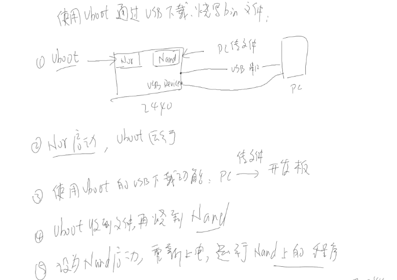
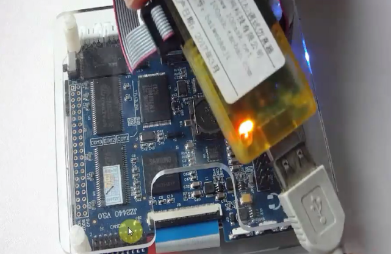
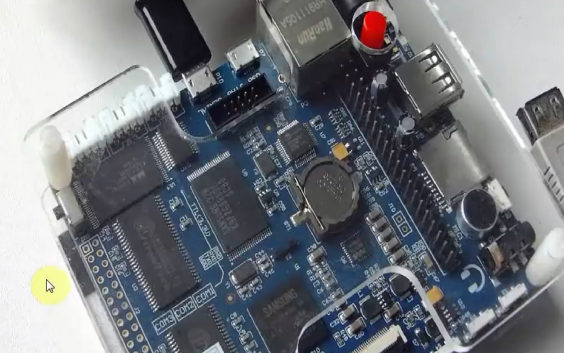
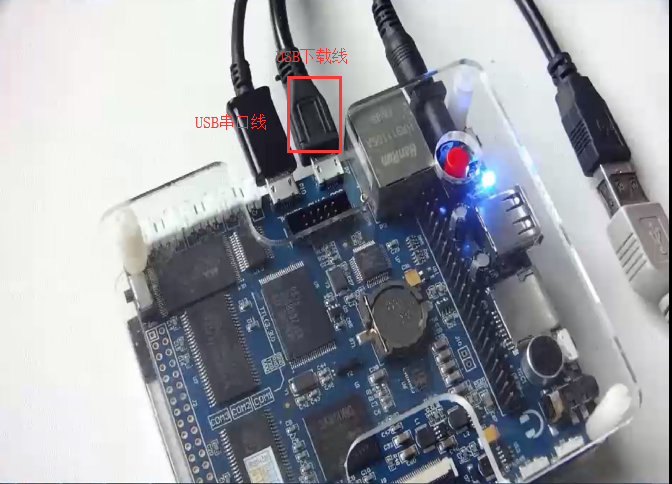
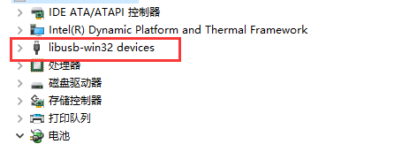
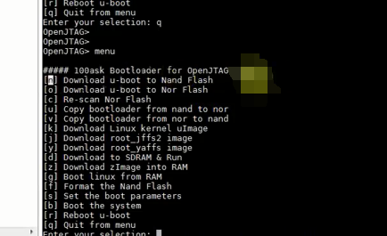
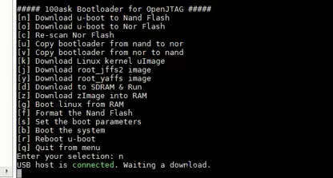
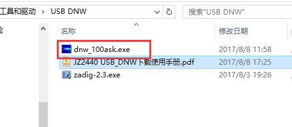

## arm开发板下载

## 1 通过uboot下载程序

### 1.1过程 

uboot烧写方法：

- 首先烧写uboot：通过jtag下载uboot。进入到u-boot.bin目录下，执行oflash u-boot.bin命令；然后选择0，选择选择下载方式；接着选择1开发板型号；然后选择1烧写到nor flash，接着选择0，烧写到第0块内存,下载uboot程序使用的up，接着开发板设置为nor启动

下载完成以后，把开发板设置为nor启动，连接USB，如图：这个是使用USB串口

连接USB下载线：

连接好后，开启，查看电脑的设备管理器是否有USB下载的端口：

如果没有，就先安装驱动。如果有的话，就可以使用USB下载功能了。

### 1.2 如何使用USB下载功能

在串口里面启动USB下载功能，例如，下载文件到nand flash的过程，在开启后，首先输入menu命令启动菜单，如图所示：

接着选择n使用u-boot下载到 Nand Flash，现在了之后，会显示如下图所示，等待选择下载的bin文件：

这时候，我们选择另外一个工具来下载bin文件，如图所示：

打开这个文件，然后选择bin文件下载。这里是下载到nand中，这时候可以选择nand启动就可以。

如果想再次使用uboot下载程序的话，就需要重新启动，并且设置为nor启动，然后重新下载程序。