# 4 内存控制器与SDRAM

## 4.1 接口类型

- GPIO/门电路：只是操作某个引脚
- 协议类接口：UART,I2C,SPI
- 内存接口：CPU发出来的地址可以直接发给设备，例如：Nor flash,网卡，内存

当CPU要操作这些接口或者设备的时候，都需要通过对寄存器操作。要操作这些寄存器，所以引入内存控制器，当CPU要操作寄存器的时候，CPU就发送地址到内存控制器，再根据不同的地址从模块中写入数据或者读出数据。如图所示：

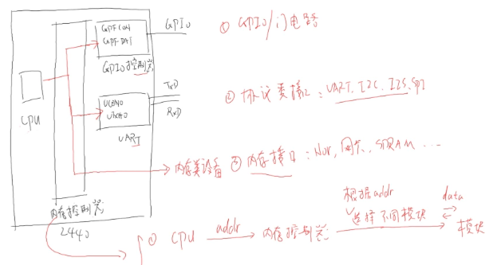

内存接口控制设备过程：如图所示

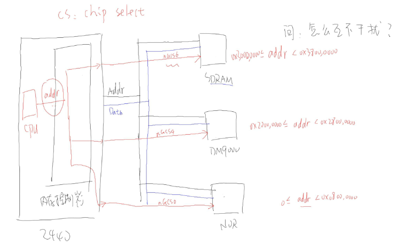

设备选择：cpu要操作某个设备的时候，首先要进行设备选择，这时候，CPU发送的地址，在内存控制器中根据地址，内存控制器通过片选信号来选择设备。每个设备都有一个地址范围例如：CPU发出的地址0x2000000~0x28000000的时候，内存控制器就使DM900设备的片选信号为0，这样就选中了该设备。

参与CPU统一编址的设备：

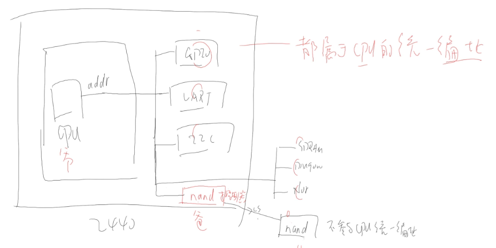

Nand flash是不参与CPU统一编址的。以上每个设备都会有个片选信号。

- 每个片选信号可以选择的地址空间为128M，如图所示：

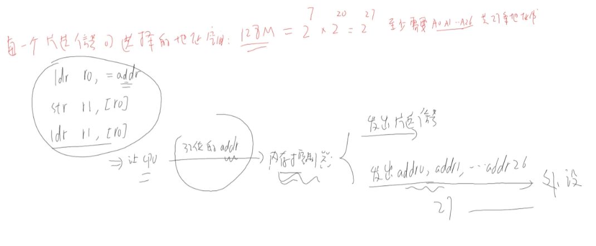

32位的处理器，为什么只需要27个地址线就可以：在CPU发送地址的时候，是发送32位地址的，但是在内存控制器这部分只用了27位。

## 4.2 如何读写设备

当CPU要对设备进行操作的时候，总需要知道数据的方向，是读还是写，所以每个设备都会至少有一根线是控制对设备进行读还是写。

## 4.3 不同位宽设备的连接

设备连接图：

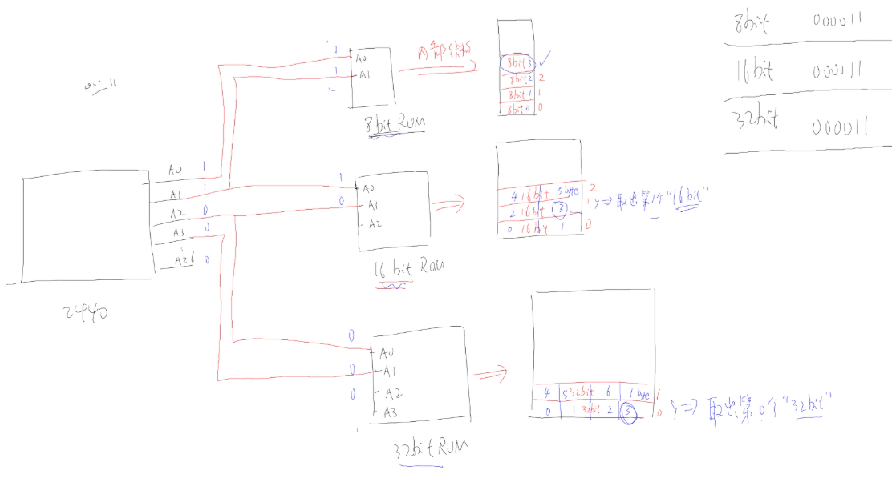

读写设备过程：

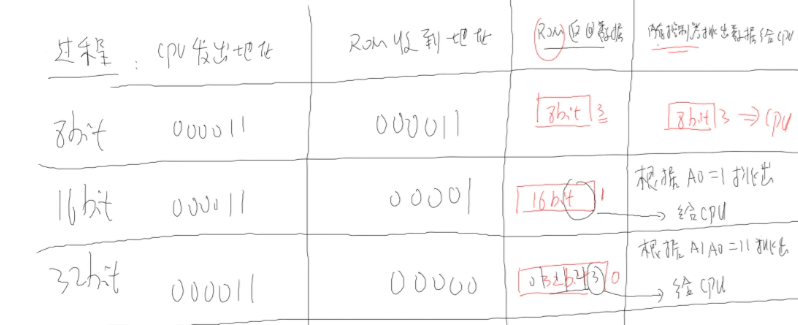

从以上可以看出，CPU发给内存控制器的地址，有一部分接在芯片上，有一部分没有接。接在芯片上的部分用来指定读写芯片上的哪一个单元，而内存控制器会使用哪些没有接的引脚来确定，从这个单元中读取出哪一个部分或者哪一个字节返回给CPU。

例如：

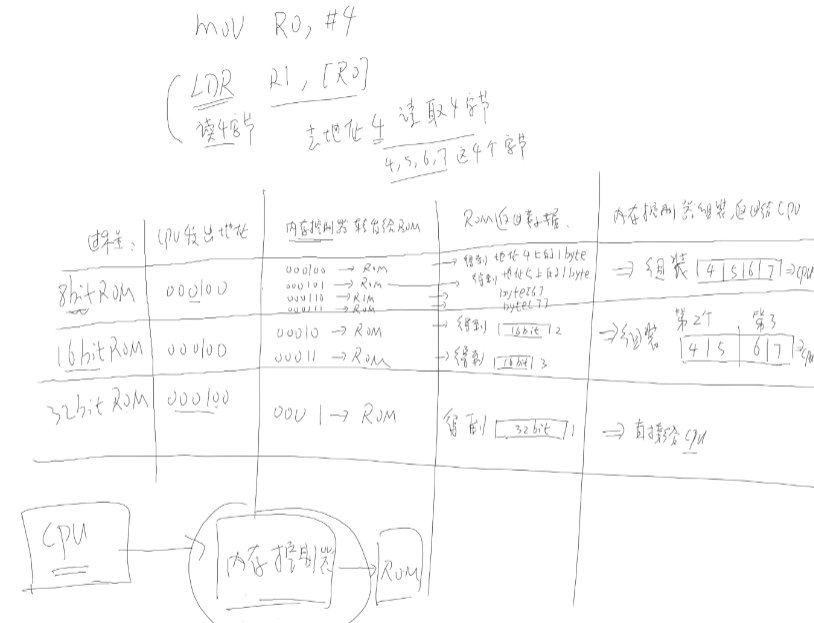

以上包括了CPU与内存控制器的交互过程。

## 4.4 如何确定芯片访问地址

- 根据 片选信号确定基地址
- 根据芯片所接地址线确定范围

例如：有些设备addr0没有接入，如果是16位的设备，则这个设备就使用addr0来确定获取高字节还是低字节，这个部分是在内存控制器来进行的。

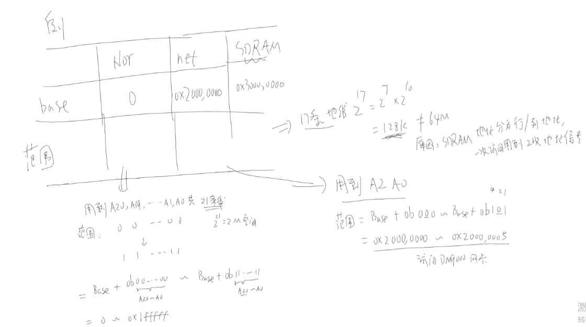

例如Nor的addr0没有接到芯片，它使用这个地址来确定读取高字节还是低字节；对于网卡，只接了addr2，但是addr0来确定读取16位中的高字节还是低字节。

计算地址：基地址+芯片的addr可表示的范围，对于SDRAM有些不同，需要访问的地址行地址和列地址分别发出，而不是同时的。

## 4.5 时序图分析示例

以Nor flash为例，它们的连线如图所示：

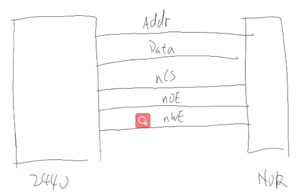

对这些信号协同工作的时序图：s2440读时序图

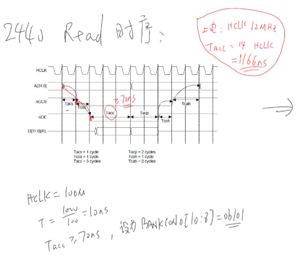

这个图上的时序，相当于一个总的时序图，要根据外接芯片的性能来设置，例如，Nor flash的时序图，可以根据以上的时序图来设置满足nor flash时序，以设置nor flash的读写速度。

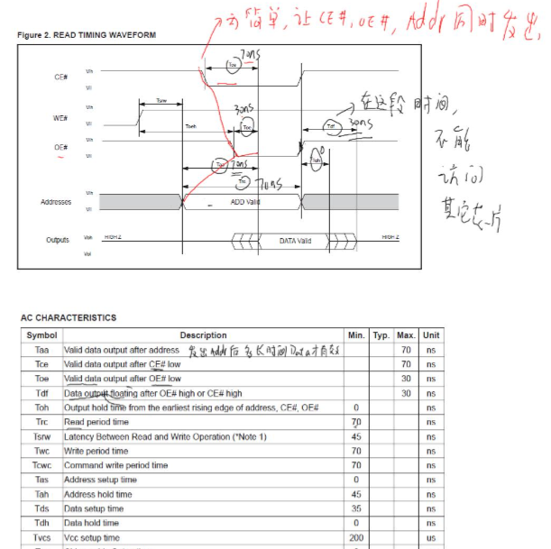

对于s2440读的时序图要满足nor flash的时序图才能够对nor flash进行读写。

所以在读写的时候，可以直接设置s2440 的时序图满足nor flash的时序即可。例如，根据设置2440 read时序来设置nor flash读写速度，直接设置Tacc >=70ns。

## 4.5 SDRAM读写过程

### 4.5.1 读写过程

- cpu发送指令到内存控制器
- 内存控制器发出片选信号选择SDRAM芯片
- 选择BANK地址（相当于表格地址）
- 发出行地址
- 发出列地址
- 读写数据

> 注意：这里行列地址是分别发出

所以在设置寄存器的时候，设置内存控制器的寄存器。