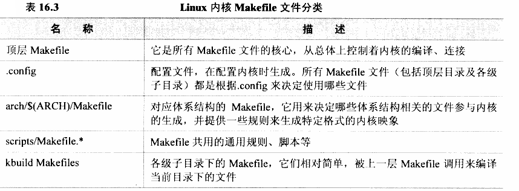
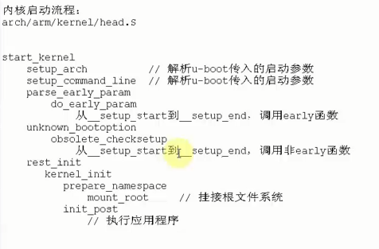
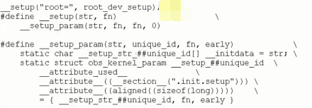
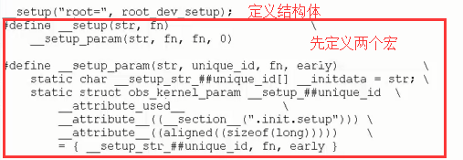

# 内核配置裁剪及启动流程

## 1 配置过程

方法：

- make menuconfig：使用默认的配置，从头到尾直接配置
- 使用默认的配置，在arch/arm/configs目录下，找到相似的配置文件，然后执行

```
make xxx_config
make menu_config // 会出现一个菜单，然后就可以通过这个菜单来设置配置项
```

- 使用厂家的配置文件

```
make xxx_config  // 厂家的配置文件
make menu_config // 会出现一个菜单，然后就可以通过这个菜单来设置配置项
```

所有的配置文件都会生成一个`.config`文件，后面会对这个文件进行分析。

## 2 编译

直接使用make就可以，如果想生成UImage(头部真正的内核)，如果想编译内核给u-boot用，那么直接编译UImage即可。

命令：

```
make uImage
```

## 3 config分析

使用DM9000来进行举例。

对于config_dm9000的来源：

- C语言:config_dm9000(宏)
- Makefile：drivers/net/makefile
- include/config/auto.config
- include/linux/autoconf.h

分析：config_dm9000的宏来源于include/linux/autoconf.h，autoconf.h是自动生成的

在使用命令`make uImage`编译内核的时候，`.config`会自动创建`autoconf.h`，并且生成`auto.config`。`autoconf.h`是被源代码调用的，`auto.config`是被顶层Makefile包含的

## 4 分析Makefile

在分析uboot的时候，从Makefile中已经得到的信息为：第一个启动文件、链接脚本（这个内核应该放在那里，里面的东西是怎么排布的）。

Linux中Makefile的分类：



> 子目录Makefile分析
>
> **应用：**子目录下的Makefile：如果有a.c和b.c要想编内核或者制作成一个模块，在Linux中应该怎么做?
>
> 1.编译进内核：obj-y+ = a.o b.o
>
> 2.如果要组合成一个模块：obj-m+=ab.o
>
> ​					 ab-objs :=a.o b.o
>
> 当我们编译的时候，a.c和b.c分别生成a.o和b.o,这两个文件会被编译成ab.ko这样一个模块。

### 4.1 顶层Makefile：

> 在我们使用`make uImage`的时候，这个目标在顶层Makefile是没有的，它在`arch/arm/Makefile`里面，所以这个`Makefile`会被包含到顶层`Makefile`中，所以顶层`Makefile`会使用`include`把该`Makefile`包含进来。

在使用make uImage的时候，依赖关系：

- uImage依赖于vmlinux
- vmlinux依赖于...

对于依赖关系的分析，从上往下，一个一个的替换掉，就可以知道这些依赖的关系。

对于Makefile里面的依赖台庞大，可以通过编译生成的日志来分析。

通过对编译生成的日志，我们可以得到内核的**第一个文件和链接脚本**：

- 第一个文件：arch/arm/kernel/head.S
- 链接脚本：arch/arm/kernel/vmlinux.lds

> 链接的顺序，与编译生成的.o文件的顺序是一致的。
>
> 而代码段、数据段等存放的位置由链接脚本决定。

## 5 内核的启动

启动过程分析：

1）处理uboot传入的参数，从第一个文件从arch/arm/kernel/head.S开始分析

```
// 从uboot启动内核的入口是从这个函数开始的，按照汇编语言的规则，这个函数的参数对应会汇编寄存器为
// r0 = 0,r1 = 362,r2 = 0x30000100，r1为传入的机器码
theKernel(0, 362, 0x30000100);  
```

### 5.1 处理传入的机器ID

head.S分析

- 判断是否支持这个处理器
- 判断是否支持这个单板，uboot启动时传入的机器ID
- 创建页表
- 使能mmu

代码分析：

```
ENTRY(stext)   # 从uboot传入的机器码判断内核是否支持这个单板
	msr	cpsr_c, #PSR_F_BIT | PSR_I_BIT | SVC_MODE @ ensure svc mode
						@ and irqs disabled
	mrc	p15, 0, r9, c0, c0		@ get processor id
	bl	__lookup_processor_type		@ r5=procinfo r9=cpuid
	movs	r10, r5				@ invalid processor (r5=0)?
	beq	__error_p			@ yes, error 'p'   
	bl	__lookup_machine_type		@ r5=machinfo # 判断是否支持这个单板
	movs	r8, r5				@ invalid machine (r5=0)?
	beq	__error_a			@ yes, error 'a'   # 如果不支持这个单板，错误就会一直循环
	bl	__create_page_tables  # 创建页表
	

	/*
	 * The following calls CPU specific code in a position independent
	 * manner.  See arch/arm/mm/proc-*.S for details.  r10 = base of
	 * xxx_proc_info structure selected by __lookup_machine_type
	 * above.  On return, the CPU will be ready for the MMU to be
	 * turned on, and r0 will hold the CPU control register value.
	 */
	ldr	r13, __switch_data		@ address to jump to after
						@ mmu has been enabled
	adr	lr, __enable_mmu		@ return (PIC) address
	add	pc, r10, #PROCINFO_INITFUNC
```

判断单板是否符合：head_common.S

```
3:	.long	.
	.long	__arch_info_begin
	.long	__arch_info_end

__lookup_machine_type:
	adr	r3, 3b    # r3 = 3b的地址
	ldmia	r3, {r4, r5, r6}  # r4 = ".",这里的点代表3b的虚拟地址,r5=__arch_info_begin,r6=__arch_info_end
	sub	r3, r3, r4			@ get offset between virt&phys
	add	r5, r5, r3			@ convert virt addresses to
	add	r6, r6, r3			@ physical address space
1:	ldr	r3, [r5, #MACHINFO_TYPE]	@ get machine type
	teq	r3, r1				@ matches loader number?
	beq	2f				@ found
	add	r5, r5, #SIZEOF_MACHINE_DESC	@ next machine_desc
	cmp	r5, r6
	blo	1b
	mov	r5, #0				@ unknown machine
2:	mov	pc, lr
```

```
b	start_kernel  #跳转到内核执行，start_kernel是跳转到内核的第一个C函数
```

### 5.2 处理传入的TAG参数

分析start_kernel：init/main.c的start_kernel函数

```
// start_kernel函数中
// 用来处理我们uboot启动的时候传进来的参数
setup_arch(&command_line);
setup_command_line(command_line);
```

start_kernel做完初始化和解析TAG参数以后，会调用rest_init函数：

```
static void noinline __init_refok rest_init(void)
	__releases(kernel_lock)
{
	int pid;

	kernel_thread(kernel_init, NULL, CLONE_FS | CLONE_SIGHAND);
	numa_default_policy();
	pid = kernel_thread(kthreadd, NULL, CLONE_FS | CLONE_FILES);
	kthreadd_task = find_task_by_pid(pid);
	unlock_kernel();

	/*
	 * The boot idle thread must execute schedule()
	 * at least one to get things moving:
	 */
	preempt_enable_no_resched();
	schedule();
	preempt_disable();

	/* Call into cpu_idle with preempt disabled */
	cpu_idle();
} 
```

rest_init又会去调用kernel_init；kernel_init又调用prepare_namespace，prepare_namespace调用mount_root，mount_root是挂载根文件系统，接着调用init_post，执行应用程序。

最终的目的：处理应用程序，在根文件系统中

### 5.3 内核启动流程




对于mount_root挂接到哪一个跟文件系统去是由命令行参数决定的。对于命令行传进来的时候，刚开始被保存在某个字符串，然后调用一些函数来分析他们。

例如：



一个名字对应着一个处理函数，这个名字和这个处理函数是被定义在一个结构体里面，这个结构体被加了一个段属性，为`.init.setup`，会被链接脚本放到一起，当调用的时候就可以从链接脚本的某一个段的start开始搜索到end。

## 6 分区问题

在Linux 嵌入式分区如何体现？直接在代码中写死的，就像BootLoader设置代码和参数存放的位置一样。

## Linux内核常用的定义结构体方法

- 首先定义两个宏
- 通过类似定义变量的方式创建结构体

例如：

