# 字符设备驱动

- uboot的任务：启动内核
- 内核：启动应用程序（应用包括点灯，按键操作等等）
- 应用程序：直接使用open，read，write类进行操作；

## 1 linux框架


应用程序（APP）里面直接通过open，read，write这种标准的接口来操作。但是驱动程序要有对应的操作。在应用接口与驱动程序是通过驱动框架来对应起来的。

## 2 LED驱动程序

目的是让应用程序与驱动程序对应起来。然后通过APP的标准接口就可以实现操作。具体过程如下：

### 2.1 写驱动程序

以led程序来举例。

- 写出驱动程序led_open,led_read,led_write。

- 写出来后如何告诉内核

- 然后内核告诉应用程序。

  - 定义一个file_oprations结构体，然后进行填充

  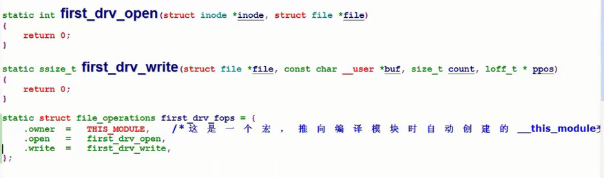

  - 把这个结构告诉内核，通过注册的方式register_chrdev

  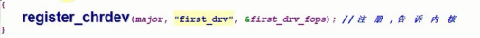

  - 驱动的入口函数调用register_chrdev，如果是第一个个程序，那么驱动的入口函数可以这样写：

  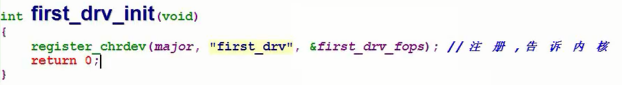

  这里的major是主设备号

  - 如何告诉内核它的入口函数是这个，需要进行修饰

  ```
  // module_init实现的是定义一个结构体，这个结构体里面有一个函数指针，指向first_drv_init，当我们去安装一个驱动程序的时候，内核就会自动找到这个结构体，然后调用里面的函数
  module_init(first_drv_init)
  ```

  - 最终应用程序如何找到我们注册的驱动程序以及file_oprations中的操作方法：通过设备类型（字符设备）和主设备号，就可以找到我们注册进去file_oprations，这个file_oprations是放在一个数组当中，内核可以通过查找的方式找到。

  驱动程序和应用程序是如何挂钩起来的：

  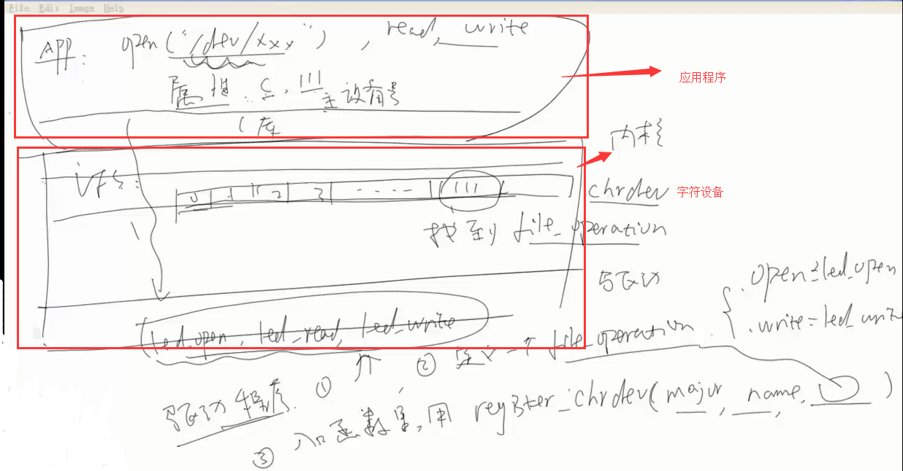

  - 卸载驱动程序：

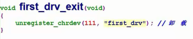

```
modules_exit(first_drv_exit);
```

### 2.2 驱动程序的编译

首先编译好内核，然后写一个驱动的Makefile，

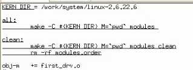

第一行表示编译好的单板内核目录。

编译，使用`make`命令，最后生成`first_drv.ko`文件。当使用的时候，把它下载到内存。

### 2.3 查看目前内核支持的设备

通过命令查看目前内核支持的。

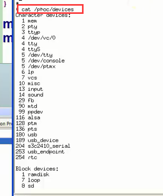

第一列是主设备号，对应于chrdev数组里面的下标。

### 2.4 加载驱动

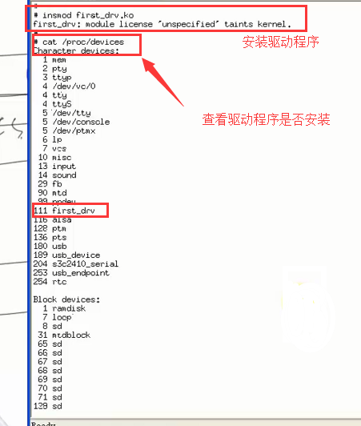

通过insmod命令来加载驱动程序。

### 2.5 驱动程序测试

加载完驱动后，写一个测试函数来测试驱动程序是否完成。例如：

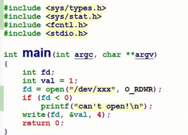

编译测试程序，编译命令如下：

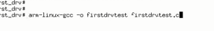

拷贝到我们制作的跟文件目录下：

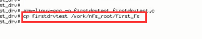

执行测试程序：

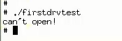

这里显示没有这个设备，不存在这个文件，所以需要创建这个设备节点。

> ## 主设备号与次设备号
>
> 主设备号的作用是帮我们找到哪一个驱动程序，次设备号是给我们设备程序用的，我们想用来做什么就做什么。

## 3 按键驱动

使用 查询的方式。步骤如下：

### 3.1 写出框架

- 写file_operation结构体，里面有open、read、write成员，用到哪一个就实现哪一个；

  ```
  static struct file_operations sencod_drv_fops = {
      .owner  =   THIS_MODULE,    /* 这是一个宏，推向编译模块时自动创建的__this_module变量 */
      .open   =   second_drv_open,     
  	.read	=	second_drv_read,	   
  };
  ```

  接着写这个结构体里面的函数：

  ```
  static int second_drv_open(struct inode *inode, struct file *file)
  {
  	return 0;
  }
  
  ssize_t second_drv_read(struct file *file, char __user *buf, size_t size, loff_t *ppos)
  {
  
  }
  ```

- 这个file_operation结构体要在入口函数里面注册到内核里面去；

  ```
  static int second_drv_init(void)
  {
  	// 主设备号写入0，让系统自动给我们分配主设备号
  	major = register_chrdev(0, "second_drv", &sencod_drv_fops); 
  	return 0;
  }
  ```

- 写出口函数，作用是通过这个函数把设备卸载

  ```
  static void second_drv_exit(void)
  {
  	unregister_chrdev(major, "second_drv");
  
  	return 0;
  }
  ```

- 修饰入口函数和出口函数

  ```
  module_init(second_drv_init);
  
  module_exit(second_drv_exit);
  ```

到这里已经搭好了基本的驱动程序框架，如果需要更加完善的话，给sysfs提供更多的信息，这些信息是udev，它可以自动创建设备节点。

- 给sysfs提供更多的信息，进一步完善驱动框架

  - 创建一个class
  - 在class下面创建一个设备

  具体实现，先定义两个结构体：

  ```
  static struct class *seconddrv_class;
  static struct class_device	*seconddrv_class_dev;
  ```

  在入口函数里面创建一个类，并在类下面创建一个设备：

  ```
  int major;
  static int second_drv_init(void)
  {
  	major = register_chrdev(0, "second_drv", &sencod_drv_fops);
  
  	seconddrv_class = class_create(THIS_MODULE, "second_drv");
  	seconddrv_class_dev = class_device_create(seconddrv_class, NULL, MKDEV(major, 0), NULL, "buttons"); /* /dev/buttons */
  
  
  	return 0;
  }
  ```

  在出口也要卸载掉：

  ```
  static void second_drv_exit(void)
  {
  	unregister_chrdev(major, "second_drv");
  	class_device_unregister(seconddrv_class_dev);
  	class_destroy(seconddrv_class);
  	return 0;
  }
  ```

- 修改Makefile

```
KERN_DIR = /work/system/linux-2.6.22.6

all:
	make -C $(KERN_DIR) M=`pwd` modules 

clean:
	make -C $(KERN_DIR) M=`pwd` modules clean
	rm -rf modules.order

obj-m	+= second_drv.o

```

到这里一个驱动程序的框架就写完了，接着就可以进行编译，复制到根文件系统。

- 加载

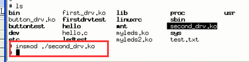

通过命令查看：button设备已经生成

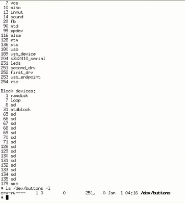

### 3.2 硬件的操作 

- 看原理图，确定引脚
- 看2440手册，操作寄存器
- 写代码

这三个步骤与写单片机的程序是一样的。

**物理地址与虚拟地址：**虚拟地址等于ioremap(物理地址，长度)

