# 字符设备驱动

- uboot的任务：启动内核
- 内核：启动应用程序（应用包括点灯，按键操作等等）
- 应用程序：直接使用open，read，write类进行操作；

## 1 linux框架

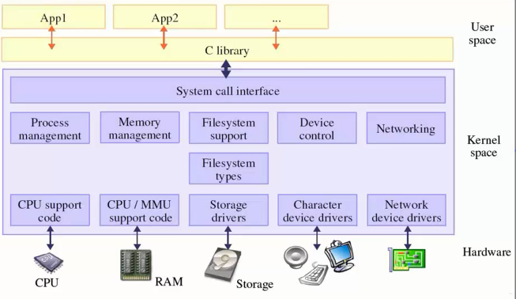

应用程序（APP）里面直接通过open，read，write这种标准的接口来操作。但是驱动程序要有对应的操作。在应用接口与驱动程序是通过驱动框架来对应起来的。

## 2 LED驱动程序

目的是让应用程序与驱动程序对应起来。然后通过APP的标准接口就可以实现操作。具体过程如下：

### 2.1 写驱动程序

以led程序来举例。

- 写出驱动程序led_open,led_read,led_write。

- 写出来后如何告诉内核

- 然后内核告诉应用程序。

  - 定义一个file_oprations结构体，然后进行填充

  

  - 把这个结构告诉内核，通过注册的方式register_chrdev

  

  - 驱动的入口函数调用register_chrdev，如果是第一个个程序，那么驱动的入口函数可以这样写：

  

  这里的major是主设备号

  - 如何告诉内核它的入口函数是这个，需要进行修饰

  ```
  // module_init实现的是定义一个结构体，这个结构体里面有一个函数指针，指向first_drv_init，当我们去安装一个驱动程序的时候，内核就会自动找到这个结构体，然后调用里面的函数
  module_init(first_drv_init)
  ```

  - 最终应用程序如何找到我们注册的驱动程序以及file_oprations中的操作方法：通过设备类型（字符设备）和主设备号，就可以找到我们注册进去file_oprations，这个file_oprations是放在一个数组当中，内核可以通过查找的方式找到。

  驱动程序和应用程序是如何挂钩起来的：

  

  - 卸载驱动程序：


```
modules_exit(first_drv_exit);
```

### 2.2 驱动程序的编译

首先编译好内核，然后写一个驱动的Makefile，


第一行表示编译好的单板内核目录。

编译，使用`make`命令，最后生成`first_drv.ko`文件。当使用的时候，把它下载到内存。

### 2.3 查看目前内核支持的设备

通过命令查看目前内核支持的。


第一列是主设备号，对应于chrdev数组里面的下标。

### 2.4 加载驱动


通过insmod命令来加载驱动程序。

### 2.5 驱动程序测试

加载完驱动后，写一个测试函数来测试驱动程序是否完成。例如：


编译测试程序，编译命令如下：


拷贝到我们制作的跟文件目录下：


执行测试程序：


这里显示没有这个设备，不存在这个文件，所以需要创建这个设备节点。

> ## 主设备号与次设备号
>
> 主设备号的作用是帮我们找到哪一个驱动程序，次设备号是给我们设备程序用的，我们想用来做什么就做什么。

## 3 按键驱动之查询方式

使用 查询的方式。步骤如下：

### 3.1 写出框架

- 写file_operation结构体，里面有open、read、write成员，用到哪一个就实现哪一个；

  ```
  static struct file_operations sencod_drv_fops = {
      .owner  =   THIS_MODULE,    /* 这是一个宏，推向编译模块时自动创建的__this_module变量 */
      .open   =   second_drv_open,     
  	.read	=	second_drv_read,	   
  };
  ```

  接着写这个结构体里面的函数：

  ```
  static int second_drv_open(struct inode *inode, struct file *file)
  {
  	return 0;
  }
  
  ssize_t second_drv_read(struct file *file, char __user *buf, size_t size, loff_t *ppos)
  {
  
  }
  ```

- 这个file_operation结构体要在入口函数里面注册到内核里面去；

  ```
  static int second_drv_init(void)
  {
  	// 主设备号写入0，让系统自动给我们分配主设备号
  	major = register_chrdev(0, "second_drv", &sencod_drv_fops); 
  	return 0;
  }
  ```

- 写出口函数，作用是通过这个函数把设备卸载

  ```
  static void second_drv_exit(void)
  {
  	unregister_chrdev(major, "second_drv");
  
  	return 0;
  }
  ```

- 修饰入口函数和出口函数

  ```
  module_init(second_drv_init);
  
  module_exit(second_drv_exit);
  ```

到这里已经搭好了基本的驱动程序框架，如果需要更加完善的话，给sysfs提供更多的信息，这些信息是udev，它可以自动创建设备节点。

- 给sysfs提供更多的信息，进一步完善驱动框架

  - 创建一个class
  - 在class下面创建一个设备

  具体实现，先定义两个结构体：

  ```
  static struct class *seconddrv_class;
  static struct class_device	*seconddrv_class_dev;
  ```

  在入口函数里面创建一个类，并在类下面创建一个设备：

  ```
  int major;
  static int second_drv_init(void)
  {
  	major = register_chrdev(0, "second_drv", &sencod_drv_fops);
  
  	seconddrv_class = class_create(THIS_MODULE, "second_drv");
  	seconddrv_class_dev = class_device_create(seconddrv_class, NULL, MKDEV(major, 0), NULL, "buttons"); /* /dev/buttons */
  
  
  	return 0;
  }
  ```

  在出口也要卸载掉：

  ```
  static void second_drv_exit(void)
  {
  	unregister_chrdev(major, "second_drv");
  	class_device_unregister(seconddrv_class_dev);
  	class_destroy(seconddrv_class);
  	return 0;
  }
  ```

- 修改Makefile

```
KERN_DIR = /work/system/linux-2.6.22.6

all:
	make -C $(KERN_DIR) M=`pwd` modules 

clean:
	make -C $(KERN_DIR) M=`pwd` modules clean
	rm -rf modules.order

obj-m	+= second_drv.o

```

到这里一个驱动程序的框架就写完了，接着就可以进行编译，复制到根文件系统。

- 加载


通过命令查看：button设备已经生成


### 3.2 硬件的操作 

- 看原理图，确定引脚
- 看2440手册，操作寄存
- 写代码

首先在open里面配置引脚，在read里面返回引脚状态，在入口函数进行地址映射

这三个步骤与写单片机的程序是一样的。

1）在入口函数建立地址映射

```
static int second_drv_init(void)
{
	major = register_chrdev(0, "second_drv", &sencod_drv_fops);

	seconddrv_class = class_create(THIS_MODULE, "second_drv");

	seconddrv_class_dev = class_device_create(seconddrv_class, NULL, MKDEV(major, 0), NULL, "buttons"); /* /dev/buttons */

// 建立地址映射
	gpfcon = (volatile unsigned long *)ioremap(0x56000050, 16);
	gpfdat = gpfcon + 1;

	gpgcon = (volatile unsigned long *)ioremap(0x56000060, 16);
	gpgdat = gpgcon + 1;

	return 0;
}
```

2）在出口解除这些映射关系：

```
static void second_drv_exit(void)
{
	unregister_chrdev(major, "second_drv");
	class_device_unregister(seconddrv_class_dev);
	class_destroy(seconddrv_class);
	// 解除代码映射
	iounmap(gpfcon);
	iounmap(gpgcon);
	return 0;
}
```

3）在open里面配置引脚

```
static int second_drv_open(struct inode *inode, struct file *file)
{
	/* 配置GPF0,2为输入引脚 ，直接清零*/
	*gpfcon &= ~((0x3<<(0*2)) | (0x3<<(2*2)));

	/* 配置GPG3,11为输入引脚 */
	*gpgcon &= ~((0x3<<(3*2)) | (0x3<<(11*2)));

	return 0;
}
```

4）读取引脚电平

```
ssize_t second_drv_read(struct file *file, char __user *buf, size_t size, loff_t *ppos)
{
	/* 返回4个引脚的电平 */
	unsigned char key_vals[4];
	int regval;

	if (size != sizeof(key_vals))
		return -EINVAL;

	/* 读GPF0,2 */
	regval = *gpfdat;
	key_vals[0] = (regval & (1<<0)) ? 1 : 0;
	key_vals[1] = (regval & (1<<2)) ? 1 : 0;
	

	/* 读GPG3,11 */
	regval = *gpgdat;
	key_vals[2] = (regval & (1<<3)) ? 1 : 0;
	key_vals[3] = (regval & (1<<11)) ? 1 : 0;
	// 使用这个函数把数据返回给用户
	copy_to_user(buf, key_vals, sizeof(key_vals));
	
	return sizeof(key_vals);
}
```

带这里就写完了驱动程序，使用make进行编译。

5）写测试程序

```

#include <sys/types.h>
#include <sys/stat.h>
#include <fcntl.h>
#include <stdio.h>

/* seconddrvtest 
  */
int main(int argc, char **argv)
{
	int fd;
	unsigned char key_vals[4];
	int cnt = 0;
	
	fd = open("/dev/buttons", O_RDWR);
	if (fd < 0)
	{
		printf("can't open!\n");
	}

	while (1)
	{
		read(fd, key_vals, sizeof(key_vals));
		if (!key_vals[0] || !key_vals[1] || !key_vals[2] || !key_vals[3])
		{
			printf("%04d key pressed: %d %d %d %d\n", cnt++, key_vals[0], key_vals[1], key_vals[2], key_vals[3]);
		}
	}
	
	return 0;
}
```

编译测试程序：

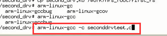

复制到根文件系统：

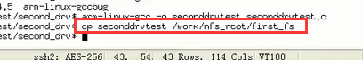

6）卸载旧的驱动，挂载新的驱动

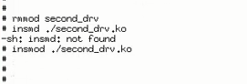

7）执行


**物理地址与虚拟地址：**虚拟地址等于ioremap(物理地址，长度)

## 4 linux中断

使用查询方式会很耗CPU的资源，因为不知道什么时候会按下，CPU会一直查询。所以使用中断的方式。

### 4.1 linux中断异常结构

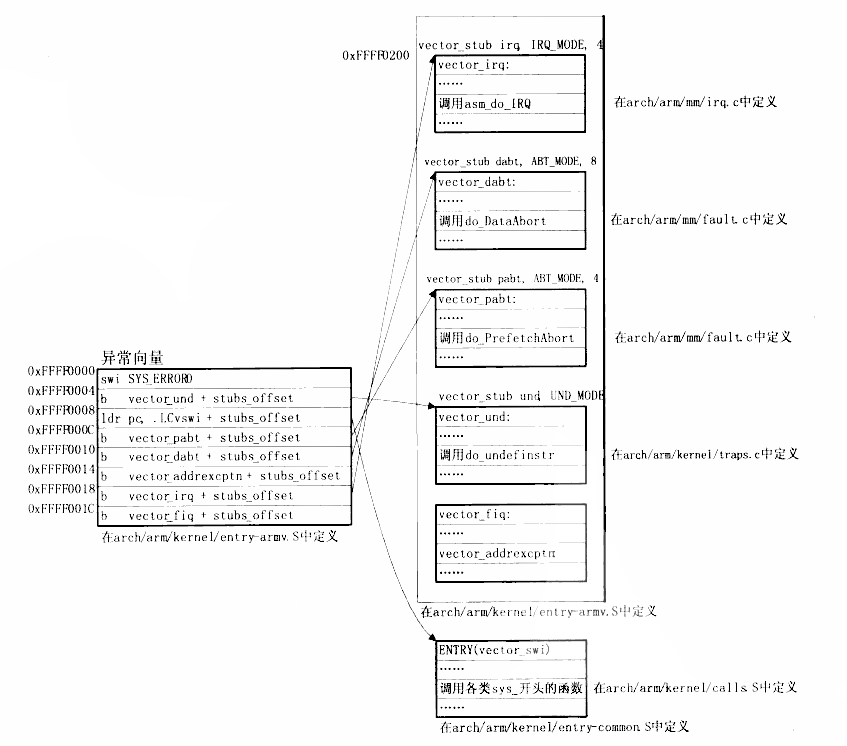

1）单片机中断与linux中断的区别

在单片机中对于中断的发生，都要判断是哪一个发生的，然后再调用相应的函数，但是在linux中，所有的中断都会调用asm_do_irq函数。

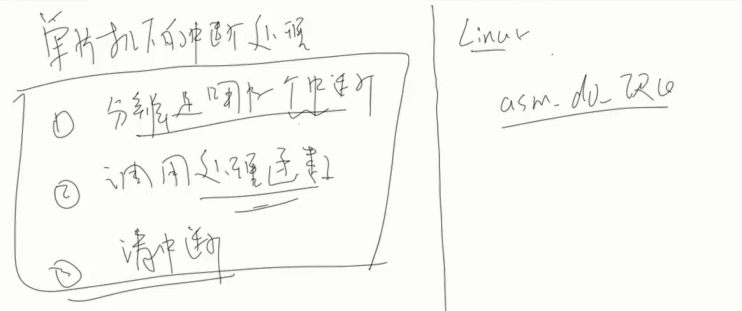

### 4.2 linux中断体系架构

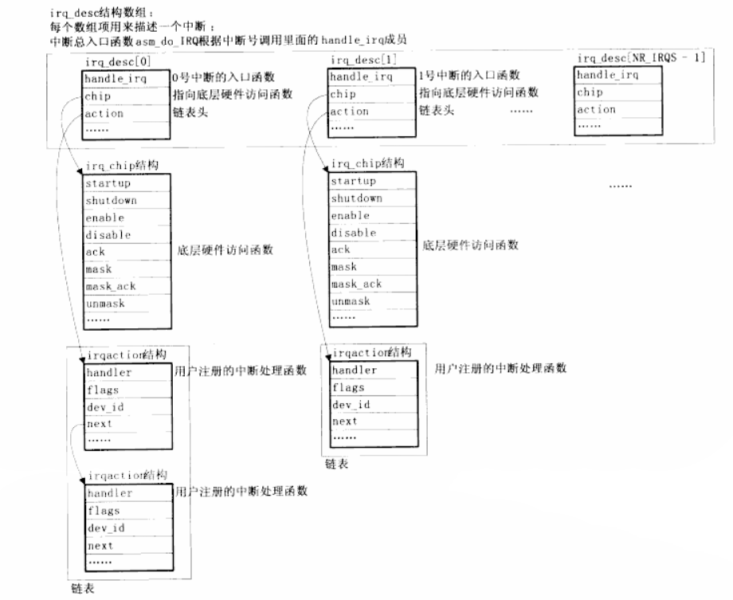

### 4.2 注册

- request_irq（注册中断）：如果要注册中断程序的话使用request_irq，会传入中断号、处理函数、flags（上升沿或者下降沿等）、名字、dev_id这些参数，然后会分配一个IRQ action结构，接着把这个结构放进irq_desc这个数组中的action链表中，然后使能设置引脚，使能中断。
- free_irq(irq,dev_id):
  - 把注册到链表的结果拖出来，然后禁止中断

## 5 按键驱动之中断方式

首先要写出框架，然后对硬件进行操作，实现的代码如下：

file_operations结构：

```
static struct file_operations sencod_drv_fops = {
    .owner   =  THIS_MODULE,    /* 这是一个宏，推向编译模块时自动创建的__this_module变量 */
    .open    =  third_drv_open,     
	.read	 =	third_drv_read,	   
	.release =  third_drv_close,	   
};
```

open：

```
static int third_drv_open(struct inode *inode, struct file *file)
{
	/* 配置GPF0,2为输入引脚 */
	/* 配置GPG3,11为输入引脚 */
	request_irq(IRQ_EINT0,  buttons_irq, IRQT_BOTHEDGE, "S2", &pins_desc[0]);
	request_irq(IRQ_EINT2,  buttons_irq, IRQT_BOTHEDGE, "S3", &pins_desc[1]);
	request_irq(IRQ_EINT11, buttons_irq, IRQT_BOTHEDGE, "S4", &pins_desc[2]);
	request_irq(IRQ_EINT19, buttons_irq, IRQT_BOTHEDGE, "S5", &pins_desc[3]);	

	return 0;
}
```

释放中断：

```
int third_drv_close(struct inode *inode, struct file *file)
{
	free_irq(IRQ_EINT0, &pins_desc[0]);
	free_irq(IRQ_EINT2, &pins_desc[1]);
	free_irq(IRQ_EINT11, &pins_desc[2]);
	free_irq(IRQ_EINT19, &pins_desc[3]);
	return 0;
}
```

写中断处理函数：

```
/* 中断事件标志, 中断服务程序将它置1，third_drv_read将它清0 */
static volatile int ev_press = 0;


struct pin_desc{
	unsigned int pin;
	unsigned int key_val;
};


/* 键值: 按下时, 0x01, 0x02, 0x03, 0x04 */
/* 键值: 松开时, 0x81, 0x82, 0x83, 0x84 */
static unsigned char key_val;

struct pin_desc pins_desc[4] = {
	{S3C2410_GPF0, 0x01},
	{S3C2410_GPF2, 0x02},
	{S3C2410_GPG3, 0x03},
	{S3C2410_GPG11, 0x04},
};


/*
  * 确定按键值
  */
static irqreturn_t buttons_irq(int irq, void *dev_id)
{
	struct pin_desc * pindesc = (struct pin_desc *)dev_id;
	unsigned int pinval;
	
	pinval = s3c2410_gpio_getpin(pindesc->pin);

	if (pinval)
	{
		/* 松开 */
		key_val = 0x80 | pindesc->key_val;
	}
	else
	{
		/* 按下 */
		key_val = pindesc->key_val;
	}

    ev_press = 1;                  /* 表示中断发生了 */
    wake_up_interruptible(&button_waitq);   /* 唤醒休眠的进程 */

	
	return IRQ_RETVAL(IRQ_HANDLED);
}
```

读操作：这里设置了休眠，如果没有按键按下的话，就进入休眠，这样能够降低CPU的使用率

```
ssize_t third_drv_read(struct file *file, char __user *buf, size_t size, loff_t *ppos)
{
	if (size != 1)
		return -EINVAL;

	/* 如果没有按键动作, 休眠 */
	wait_event_interruptible(button_waitq, ev_press);

	/* 如果有按键动作, 返回键值 */
	copy_to_user(buf, &key_val, 1);
	ev_press = 0;
	
	return 1;
}

```

写测试程序：

```

#include <sys/types.h>
#include <sys/stat.h>
#include <fcntl.h>
#include <stdio.h>
#include <unistd.h>

/* thirddrvtest 
  */
int main(int argc, char **argv)
{
	int fd;
	unsigned char key_val;
	
	fd = open("/dev/buttons", O_RDWR);
	if (fd < 0)
	{
		printf("can't open!\n");
	}

	while (1)
	{
		//read(fd, &key_val, 1);
		//printf("key_val = 0x%x\n", key_val);
		sleep(5);
	}
	
	return 0;
}
```

编译，并复制到根目录下：

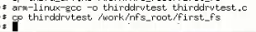

装载驱动程序：

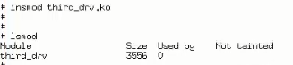

运行驱动程序：


查看驱动状态：

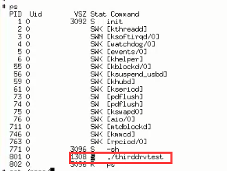

查看开启的中断：

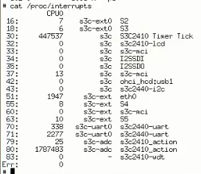

最后运行测试程序。