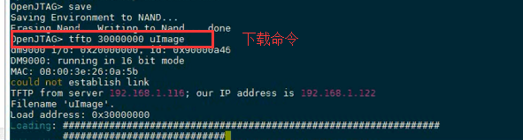

# 开发板网络问题

## 1 uboot下设置开发板ip


## 2 通过网络下载程序

**这些都是在uboot下进行设置的。**

设置tft，然后通过网络下载程序到开发板，设置过程如下：

- 设置serverip为Windows的ip，这里假设是从Windows上下载的


这里相当于设置了服务器的ip。

- 在Windows上启动tft服务器软件


然后使用命令进行下载：



## ip设置

对于uboot和linux设置的ip是不同的，uboot的ip是不能传到linux的。

- uboot下:

```
set ipaddr xxx.xxx.xxx.xxx
set serverip xxx.xxx.xxx.xxx
```

- linux下：

```
ifconfig eth0 xxx.xxx.xxx.xxx
```

