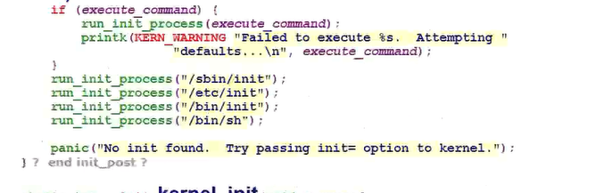
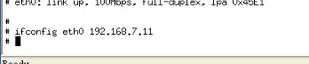
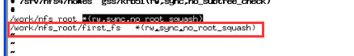
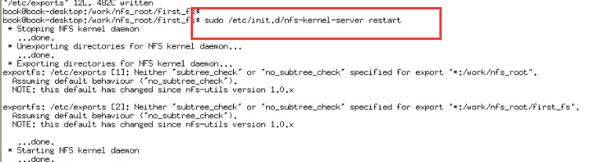
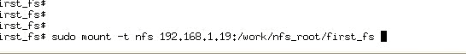
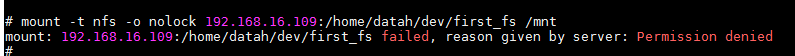
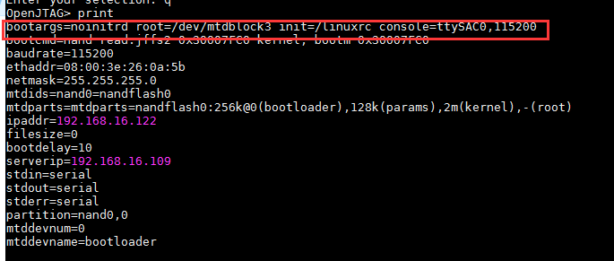

# 根文件系统

- u-boot:启动内核
- 内核：启动应用程序

应用程序位于根文件系统。本篇主要是如何构建文件系统。

> 挂接根文件系统后，执行应用程序在int_post这个函数。

## 1 内核怎么样启动第一个应用程序

- open(dev/console),打开设备，打印是从这个应用输出的
- sys_dup(0)，sys_dup(0)，这两个是也是指open(dev/console)

## 2 通过该NFS挂接根文件系统

<<<<<<< HEAD



=======
1）设置ip：



2）然后使用ping命令看是否能够连接服务器；

3）手动挂接根文件系统

- 从flash上启动根文件系统，再用命令接NFS

> 挂接NFS需要的条件：
>
> 1. 服务器“允许”那个目录的文件可以被挂接
>    1. 在"/etc/exports"中定义这个目录即可
> 2. 开发板去挂接

设置服务器允许某个文件夹被挂接：


设置可以被挂接的目录：



重启：



测试一下服务器是不是能自己挂载自己：



开发板上挂接服务器系统文件：

```
// 挂接之前先设置ip
ifconfig eth0 192.168.16.112
mount -t nfs -o nolock 192.168.16.109:/work/nfs_root/first_fs /mnt
```

挂接权限失败：



需要在根文件目录下创建才可以。

4）设置驱动为NFS启动方式：

以上使用手动挂载，是启动之后进行挂载的，这里直接设置NFS启动。需要修改命令行参数：



我们需要修改root=/dev/mtdblock3 

我们需要在uboot中设置启动参数,在 linux 内核的 Documention\nfsroot.txt 中有说明用法。    

```
nfsroot=[<server-ip>:]<root-dir>[,<nfs-options>]
ip=<client-ip>:<server-ip>:<gw-ip>:<netmask>:<hostname>:<device>:<autoconf>
noinitrd root=/dev/nfs nfsroot=[<server-ip>:]<root-dir>[,<nfs-options>] ip=<client-ip>:<server-ip>:<gwip>:<netmask>:<hostname>:<device>:<autoconf>
[<server-ip>:] 服务器IP。
<root-dir> 服务器上哪个目录设置成被单板挂载。
[<nfs-options>] 用中括号表示的参数可以省略。尖括号的不可省略。
<client-ip> 表示单板的IP。
<server-ip> 服务器IP。
<gw-ip> 网关，单板和服务器同一网段。
<netmask> 子网掩码
<hostname> 不关心这个，不要。
<device> 网卡，如 eth0\eth1
<autoconf> 自动配置，这个不需要。写成 off
```

所以参数设置为：

```
// 原来的启动参数： set bootargs noinitrd root=/dev/mtdblock3 init=/linuxrc console=ttySAC0
// 设置成nfs启动的参数
set bootargs noinitrd root=/dev/nfs nfsroot=192.168.16.109:/work/nfs_root/first_fs ip=192.168.16.112:192.168.16.109:192.168.16.55:255.255.255.0::eth0:off init=/linuxrc console=ttySAC0
```

设置完成之后启动开发板就是直接挂接到服务器的跟文件系统。

```
set bootargs noinitrd root=/dev/nfs nfsroot=192.168.109:/work/nfs_root/first_fs ip=192.168.16.112:192.168.109:192.168.16.1:255.255.255.0::eth0:off init=/linuxrc console=ttySAC0
```
