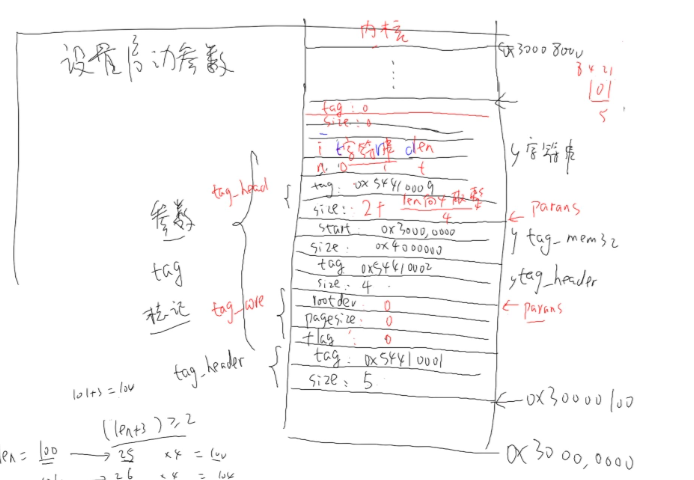

# 自己写BootLoader

目标：启动内核

## 1 最简单的BootLoader编写步骤

### 1.1 初始化硬件

- 关看门狗
- 设置时钟
- 设置SDRAM
- 初始化NAND FLASH

- 把内核从NAND FLASH读到SDRAM

代码实现：start.S

```

#define S3C2440_MPLL_200MHZ     ((0x5c<<12)|(0x01<<4)|(0x02))
#define MEM_CTL_BASE    0x48000000

.text
.global _start
_start:

/* 1. 关看门狗 */
	ldr r0, =0x53000000    // 这个是一条为伪汇编指令，使r0指向地址0x53000000
	mov r1, #0			   // r1 = 0，如果只比较简单可以直接使用mov指令
	str r1, [r0]           // 把r1上的值，存到r0所指地址

/* 2. 设置时钟 */
	ldr r0, =0x4c000014		// r0指向地址0x4c000014
	mov r1, #0x03;            // FCLK:HCLK:PCLK=1:2:4, HDIVN=1,PDIVN=1,r1 = 0x03
	str r1, [r0]     		// 把r1的值存到r0所指向的地址

	/* 如果HDIVN非0，CPU的总线模式应该从“fast bus mode”变为“asynchronous bus mode” */
	mrc	p15, 0, r1, c1, c0, 0		/* 读出控制寄存器 */ 
	orr	r1, r1, #0xc0000000			/* 设置为“asynchronous bus mode” */
	mcr	p15, 0, r1, c1, c0, 0		/* 写入控制寄存器 */

	/* MPLLCON = S3C2440_MPLL_200MHZ */
	ldr r0, =0x4c000004          // r0 指向地址0x4c000004
	ldr r1, =S3C2440_MPLL_200MHZ
	str r1, [r0]                 // 把r1这个值存放到r0所指的位置

/* 3. 初始化SDRAM */
	ldr r0, =MEM_CTL_BASE		// 使r0指向基地址
	adr r1, sdram_config     /* sdram_config的当前地址 */
	add r3, r0, #(13*4)			// 为了循环做判断，使r3= r0 + 13*4
1:
	ldr r2, [r1], #4		// 从r1的地方读到一个值。保存到r2,并且让r1+4
	str r2, [r0], #4     	// 把r2的值存到r0所指的地址，然后让r0+4
	cmp r0, r3              // 判断r0是否读完
	bne 1b					// 如果不行等的话，跳回前面的1标号，b表示后面

/* 4. 重定位 : 把bootloader本身的代码从flash复制到它的链接地址去 */
	ldr sp, =0x34000000		// 要使用C语言之前要先设置栈，把它指定到一块没有使用的内存即可

	bl nand_init		// 初始化nand

	mov r0, #0	// 第一个参数，nor或者nand的0地址的代码复制到连接地址里面，所以第一个参数是0
	ldr r1, =_start	// 第二个参数，目的=链接地址
	ldr r2, =__bss_start	// 第三个参数，长度，需要看连接脚本，__bss_start为结束地址，不包含bss段
	sub r2, r2, r1		// r2 = r2 -r1,长度
	
	bl copy_code_to_sdram
	bl clear_bss		// 给bss段清0
	
/* 5. 执行main */
	ldr lr, =halt		// 设置返回地址，lr寄存器是保存函数返回地址的
	ldr pc, =main		// 跳转到main函数执行，也可以使用bl main，但是这个
						// 指令是相对的跳转,如果是使用ldr pc,=main的话，它
						// 就会跳转到SDRAM中取执行，
	// 假设main函数有返回的话，就会在这里死循环，以防程序乱跑		
halt:
	b halt

sdram_config:
	.long 0x22011110	 //BWSCON
	.long 0x00000700	 //BANKCON0
	.long 0x00000700	 //BANKCON1
	.long 0x00000700	 //BANKCON2
	.long 0x00000700	 //BANKCON3  
	.long 0x00000700	 //BANKCON4
	.long 0x00000700	 //BANKCON5
	.long 0x00018005	 //BANKCON6
	.long 0x00018005	 //BANKCON7
	.long 0x008C04F4	 // REFRESH
	.long 0x000000B1	 //BANKSIZE
	.long 0x00000030	 //MRSRB6
	.long 0x00000030	 //MRSRB7
```

### 1.2 参数传递 

对于这些参数是uboot和内核约定好存放在哪里，当执行uboot的时候，就把这些参数存放到到这些地址，然后跳转执行内核的时候就可以在这些内存中读取出这些数据。因为在执行内核的时候，uboot已经执行结束，所以双方约定参数的存放地址

- 设置要传给内核的参数(TAG标记)--仿照uboot来写
  - setup_start_tag：开始参数
  - setup_memory_tags：存储参数
  - setup_commandline_tag：设置命令行参数
  - setup_end_tag：结束参数

tag存放参数图：



代码：

```
注意：这里的site都是以4位单位的，如果site=1，那么表示四个字节
void setup_start_tag(void)
{
	params = (struct tag *)0x30000100; // 从哪里开始存放参数
	/*头部*/
	params->hdr.tag = ATAG_CORE;			// 表示开始参数，表示tag类型
	params->hdr.size = tag_size (tag_core);   // 头部大小，为5
	/*一个联合体*/
	params->u.core.flags = 0;
	params->u.core.pagesize = 0;
	params->u.core.rootdev = 0;

	params = tag_next (params);		// 指向下一个tag
}

void setup_memory_tags(void)      
{
	params->hdr.tag = ATAG_MEM;   // 表示内存参数,表示tag类型
	params->hdr.size = tag_size (tag_mem32);
	
	params->u.mem.start = 0x30000000;   // 内存的开始地址
	params->u.mem.size  = 64*1024*1024; // 内存的长度，64M
	
	params = tag_next (params);		    // 指向下一个tag
}

void setup_commandline_tag(char *cmdline)
{
	int len = strlen(cmdline) + 1;
	
	params->hdr.tag  = ATAG_CMDLINE;    // 表示tag类型
	// 这里的长度要向4取整，sizeof (struct tag_header) = 2
	// 长度为：(2*4 + len + 3) /4 ,向4取整
	params->hdr.size = (sizeof (struct tag_header) + len + 3) >> 2;  // 向4取整，所以要除于4

	strcpy (params->u.cmdline.cmdline, cmdline);

	params = tag_next (params);
}

void setup_end_tag(void)
{
	params->hdr.tag = ATAG_NONE;
	params->hdr.size = 0;
}
```


### 1.3 跳转执行内核

跳转代码：

```
参数：arch，表示机器id，单板的号码，在内核中会有指定该该单板的号码，可以在那和中查看支持哪些单板；params，表示参数的位置
void (*theKernel)(int zero, int arch, unsigned int params);
.
.
.
theKernel = (void (*)(int, int, unsigned int))0x30008000;
theKernel(0, 362, 0x30000100);  
/* 汇编实现
* 设置3个参数，然后跳转到内核的起始位置开始执行
*  mov r0, #0
*  ldr r1, =362
*  ldr r2, =0x30000100
*  mov pc, #0x30008000 
*/
```

## 2 改进

问题：在启动的时候太慢，主要问题是在从nand flash中把数据copy到SDRAM中。

- 解决方法1：提高CPU频率，把200MHZ-->400MHZ，没有显著的提高
- 解决方法2：启动ICACHE，效果很明显，启动速度变快

ICACHE：高速内存


