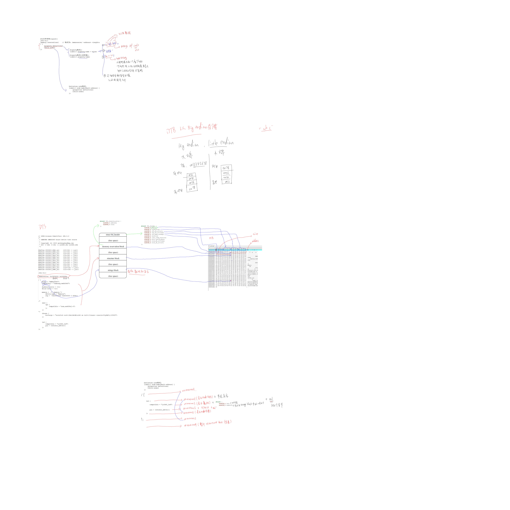

# 设备树

a. 使用"总线设备驱动模型"编写的驱动程序分为platform_device和platform_driver两部分
   platform_device : 指定硬件资源, 来自.c文件
   platform_driver : 根据与之匹配的platform_device获得硬件资源, 并分配/设置/注册file_operations
b. 实际上platform_device也可以来自设备树文件.dts
   dts文件被编译为dtb文件, 
   dtb文件会传给内核, 
   内核会解析dtb文件, 构造出一系列的device_node结构体,
   device_node结构体会转换为platform_device结构体

   所以: 我们可以在dts文件中指定资源, 不再需要在.c文件中设置platform_device结构体

c. "来自dts的platform_device结构体" 与 "我们写的platform_driver" 的匹配过程:
    "来自dts的platform_device结构体"里面有成员".dev.of_node", 它里面含有各种属性, 比如 compatible, reg, pin
    "我们写的platform_driver"里面有成员".driver.of_match_table", 它表示能支持哪些来自于dts的platform_device如果"of_node中的compatible" 跟 "of_match_table中的compatible" 一致, 就表示匹配成功, 则调用 platform_driver中的probe函数;
在probe函数中, 可以继续从of_node中获得各种属性来确定硬件资源


## 1 入门应用

### 1.1 编译

```
make dtbs     // 生成 arch/arm/boot/dts/xxx.dtb
```

生成dtb文件，把这个dtb文件复制到设备树分区即可使用。

### 1.2 查看平台下设备树注册的节点

在/sys/devices/platform/目录下。

## 2 分析与写设备树驱动

- 使用"总线设备驱动模型"编写的驱动程序分为platform_device和platform_driver两部分

  - platform_device : 指定硬件资源, 来自.c文件
  - platform_driver : 根据与之匹配的platform_device获得硬件资源, 并分配/设置/注册file_operations

- 实际上platform_device也可以来自设备树文件.dts
     dts文件被编译为dtb文件, 
     dtb文件会传给内核, 
     内核会解析dtb文件, 构造出一系列的device_node结构体,
     device_node结构体会转换为platform_device结构体

     所以: 我们可以在dts文件中指定资源, 不再需要在.c文件中设置platform_device结构体

- "来自dts的platform_device结构体" 与 "我们写的platform_driver" 的匹配过程:
   "来自dts的platform_device结构体"里面有成员".dev.of_node", 它里面含有各种属性, 比如 compatible, reg, pin
   "我们写的platform_driver"里面有成员".driver.of_match_table", 它表示能支持哪些来自于dts的platform_device

如果"of_node中的compatible" 跟 "of_match_table中的compatible" 一致, 就表示匹配成功, 则调用 platform_driver中的probe函数;
    在probe函数中, 可以继续从of_node中获得各种属性来确定硬件资源


## 3 设备树DTS与DTB

### 3.1 DTS

#### 3.1.1 属性定义


#### 3.1.2 设备节点定义

- 同一个级别，节点的名称不能一样；
- 节点中可以有子节点；

特殊节点属性：

```
特殊的、默认的属性:
a. 根节点:
#address-cells   // 在它的子节点的reg属性中, 使用多少个u32整数来描述地址(address)
#size-cells      // 在它的子节点的reg属性中, 使用多少个u32整数来描述大小(size)
compatible       // 定义一系列的字符串, 用来指定内核中哪个machine_desc可以支持本设备
                 // 即这个板子兼容哪些平台 
                 // uImage : smdk2410 smdk2440 mini2440     ==> machine_desc         
                 
model            // 咱这个板子是什么
                 // 比如有2款板子配置基本一致, 它们的compatible是一样的
                 // 那么就通过model来分辨这2款板子
                 
b. /memory
device_type = "memory";
reg             // 用来指定内存的地址、大小

c. /chosen
bootargs        // 内核command line参数, 跟u-boot中设置的bootargs作用一样

d. /cpus
/cpus节点下有1个或多个cpu子节点, cpu子节点中用reg属性用来标明自己是哪一个cpu
所以 /cpus 中有以下2个属性:
#address-cells   // 在它的子节点的reg属性中, 使用多少个u32整数来描述地址(address)

#size-cells      // 在它的子节点的reg属性中, 使用多少个u32整数来描述大小(size)
                 // 必须设置为0


e. /cpus/cpu*
device_type = "cpu";
reg             // 表明自己是哪一个cpu

```

引用其他节点:

```
引用其他节点:
a. phandle : // 节点中的phandle属性, 它的取值必须是唯一的(不要跟其他的phandle值一样)

pic@10000000 {
    phandle = <1>;
    interrupt-controller;
};

another-device-node {
    interrupt-parent = <1>;   // 使用phandle值为1来引用上述节点
};

b. label:

PIC: pic@10000000 {
    interrupt-controller;
};

another-device-node {
    interrupt-parent = <&PIC>;   // 使用label来引用上述节点, 
                                 // 使用lable时实际上也是使用phandle来引用, 
                                 // 在编译dts文件为dtb文件时, 编译器dtc会在dtb中插入phandle属性
};
```

- dts可以包含dtsi文件，并且dtsi的语法格式与dts一样；
- 可以使用dtsi中的label来重新制定某个节点中的属性；

### 3.2 DTB



## 4 内核对设备树的处理

