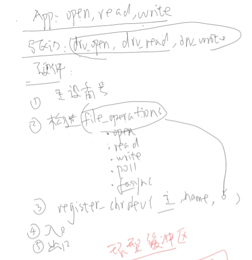
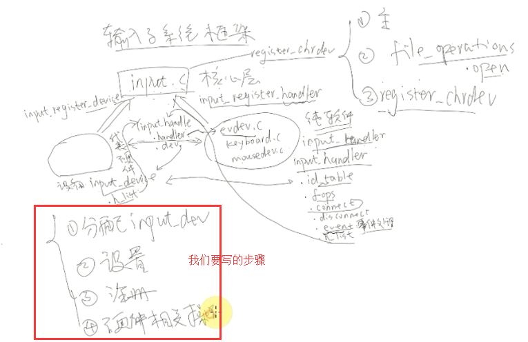
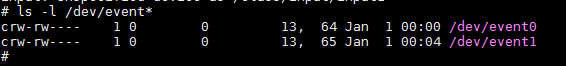
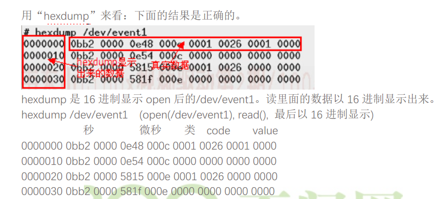

# 输入子系统

## 1 自己写驱动的步骤




## 2 使用输入子系统写驱动

框架与步骤如图所示：



## 3 挂载NFS文件系统

```
// 1.配置开发板的ip
ifconfig eth0 192.168.16.112
// 2.挂载服务器的文件系统
mount -t nfs -o intr,nolock,rsize=1024,wsize=1024 192.168.16.109:/work/nfs_root/first_fs  /mnt
```

挂载文件系统：

```
insmod  buttons.ko
```

查看：

```
ls -l /dev/event*
```



event1是我们刚挂载的驱动。

挂载出现的问题:

[nfs:server .... not responding,still trying问题解决方法](https://blog.csdn.net/suz_cheney/article/details/41410629)

## 4 测试

方法一：

```
// 打开event1设备，并把获取到的信息以16进制显示
hexdump /dev/event1
```

得到的数据如下：



方法二：


## 5 卸载驱动

```
rmmod buttons
```

